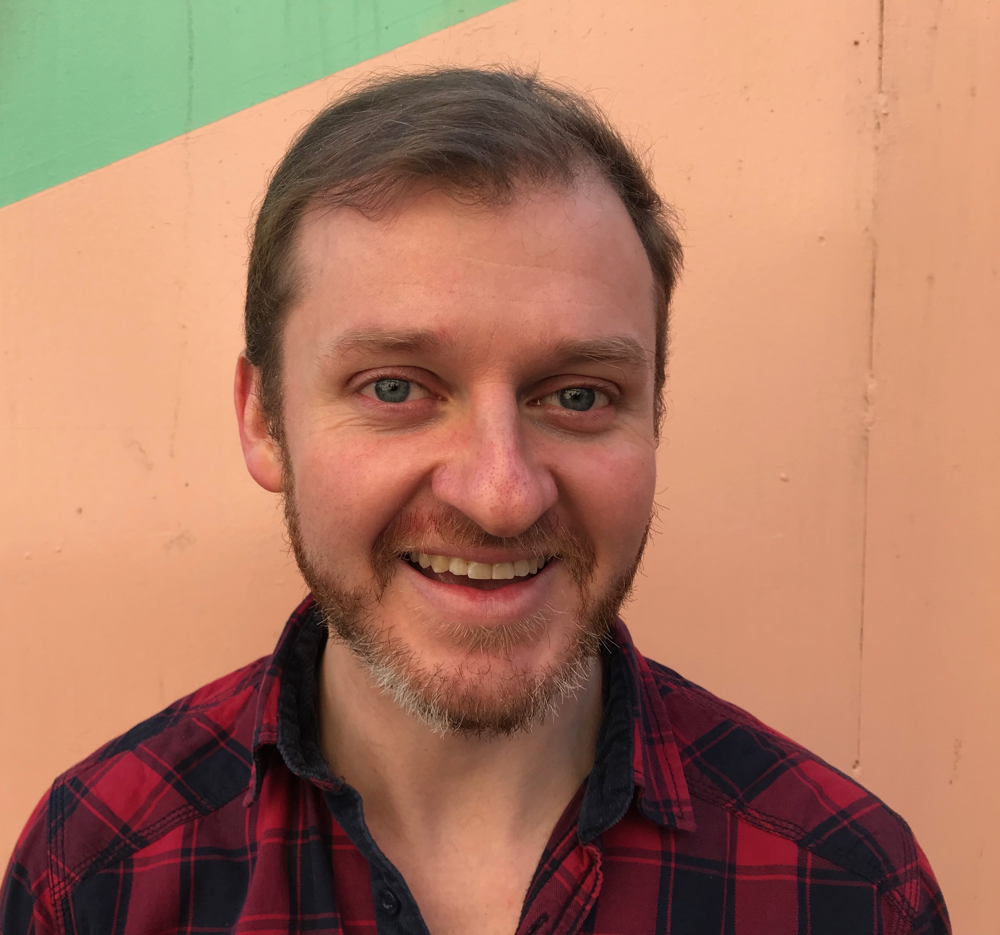

# Thomas Schwartz

<i> Teaching us to sail on winds of communication </i>

### Projects chronologically    
**_August 2019 - May 2020:_** Stonybrook University:  
Masters of Arts in Teaching English to Speakers of Other Languages  
**Articles**
<a href= "https://nostrathomas0.github.io/1/"> Downloads </a>  
  
**Courses** with code and grade received (* indicates course in progress)
* TESOL Pedagogy: Theory & Practice LIN524 (A)
* Phonetics LIN 522 (A-)
* Structure of English LIN527 (A)
* Intro to General Linguistics LIN530 (A)
* Computational Linguistics LIN537 (A)
* Bilingualism LIN541 (A)
* Field Experience in TESOL Grades K-6 LIN579 (50 hours of observactions at Flower  Hill Primary School) 
* TESOL Pedagogy: Curriculum Design and Evaluation *
* Content-Based Language and Literacy Devlopment LIN529 *
* Precalculus MAT123*
* Second Language acquisition LIN532 *
* Contrastive Analysis *
* Field Experience in Adult and Tertiary Contexts *
* Field Experience in TESOL Grades 6-12 *
* Chinese 101 *

**Grants & Honors**
Graduate student prize for professional development  

**_2018-2019:_**    :
* Syllabus & Curriculum design for a new online IELTS course 
* Instructed undergrad general English prepatory course 
* Off and on site lessons in general, business and English for specific purposes
* Presentations for teacher training in writing, graphic organizers and music in the classroom
* Stage manager and dancer for _We Will Rock You!_

**_2016-2018_** After traveling a bit, I returned to Turkey to teach Academic English.   [RumeliDE Language and Literature Research Journal] (http://www.rumelide.com/)
* Our team was responsible for instruction, curriculum, testing, and assessment.
* I led a branch of this team that did research, training, web content, interviews, writing and administering student surveys.
* After studying metacognitive protocols, I wrote curricula and administrated a workshop for students. I presented methodology, curricula and findings at Düzge International Conference On Writing in  October 2018. ![Branching Out Ideas, A Workshop Study of Mind Maps] (http://www.rumelide.com/dergi/arsiv/rumelide-2018-13--december.html)  

**_2011-2016_** I found a new career as an EFL teacher. Then I started teaching in Turkey. I wrote environmental journalism for and freelance for advertorial contracts including the Albanian Government.    
    
* I recruiters from Dialogue Language School to train each other
* I taught 8 different English and music lessons and developed activities including a guitar class for grades 4-9
* Teacher Training Collaboration, Dialogue Schools
* I instructed yoga workshops in Turkish at Gönüllü Hareketi volunteer center 

**_2007-2011_** I worked between Leadville CO and Dunkirk NY as a newspaper reporter and freelance writer for magazines and websites. I also worked between Breckenridge CO and Ohiopyle PA in adventure sports and photography.
* Hundreds of my articles were published, I interviewed community members, answered phones for obits and community calendar, and administered the Dunkirk Observer's  
* Internship at The Leadville Chronicle (defunct) 
* Community bike repair at Spoke Folk Dunkirk 2008-2010
* Curator Adams Art Gallery Dunkirk Internship at The Leadville Chronicle 2010

Stony Brook, NY  
Email:Growlroar@gmail.com  
Tel:+9054 839 5916  
	Skype: ThomaSchwartz  
   
Skills & clout  
Special training: Red cross lifeguard training SUNY Fredonia, SCUBA certification, First aid/CPR Wilderness Voyageurs Rafting Co

Educational: Consultancy and presentation on mind maps, meta-cognition or other topics; English teaching including test prep, company services & kids; Music, Turkish or tech

Writing and Journalism: MLA style, excellent communication and writing skills, research and investigation, typing, pagination and layout programs, good photo and video shoots and edits 

Languages: Turkish – B1 certification from TÖMER Bursa 2013. I've used Turkish as a language of instruction for mind map workshops.

Articles  
Branching Out ideas: a workshop and curricula on mindmaps: upcoming publication in the March edition of RumeliDE, Journal on Language and Literature.	        2018

Advertorials, commissioned by Pronto Publishing		           2015-2016  
Social Media New Zealand: John Lai                            2007- 2010  
Articles on yesilist.com  
topics: green cities, Ülüdağ gondola, environmental cost analysis           2015 

Internships and volunteering  
Free lessons for refugees, Istanbul 2012-2018, A M
Reading is Fun Club : Stonybrook U 2019
